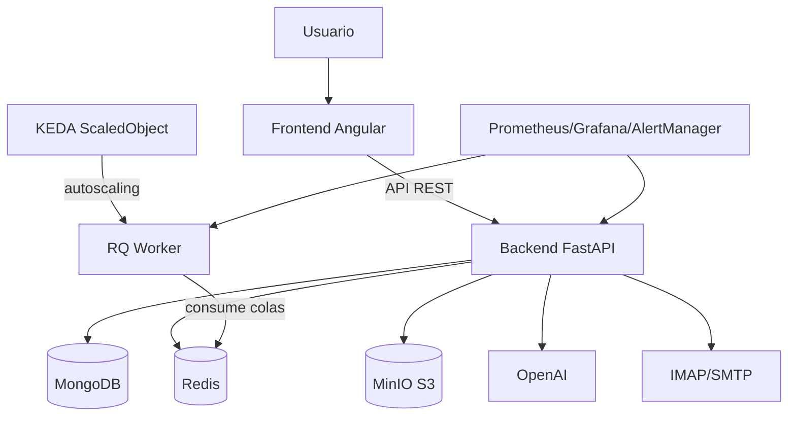

# CuenlyApp

CuenlyApp es una herramienta automatizada para extraer información de facturas a partir de correos electrónicos y consolidarla en archivos Excel, con observabilidad completa y analytics integrado.

🎯 **Estado actual**: Sistema de monitoreo centralizado y Firebase Analytics completamente funcional.

## 🚀 Características Principales

- **Procesamiento Inteligente de Facturas**
  - Conexión automática a cuentas de correo para recuperar facturas
  - Extracción de PDFs adjuntos o desde enlaces web
  - Procesamiento de PDFs mediante OCR avanzado
  - Uso de inteligencia artificial (GPT) para identificar datos clave
  - Exportación automática a Excel con templates personalizables

- **Interfaz y Experiencia de Usuario**
  - Interfaz web moderna y responsive
  - Sistema de notificaciones elegante (sin popups intrusivos)
  - Panel de administración completo con gestión de usuarios y planes
  - Autenticación segura con Firebase Auth
  - Control de suscripciones y límites de uso

- **Observabilidad y Monitoreo**
  - Métricas completas con Prometheus y Grafana
  - Logs estructurados en formato JSON
  - AlertManager para notificaciones críticas por email
  - Firebase Analytics para tracking de uso y comportamiento
  - Dashboards personalizados para monitoreo en tiempo real

- **API y Integración**
  - API RESTful completa para integración con otros sistemas
  - Autenticación por API Key para servicios externos
  - Documentación automática con FastAPI/OpenAPI
  - Rate limiting y middleware de seguridad

## 🧱 Arquitectura



- **Backend (FastAPI + Python 3.11+)**: API principal, lógica de negocio, scheduler y procesamiento de documentos.
- **Worker (RQ)**: ejecución de jobs en colas `high/default/low`, con autoscaling vía KEDA.
- **Frontend (Angular 17 + Firebase)**: interfaz web, auth y analytics.
- **Datos y servicios**: MongoDB, Redis, MinIO, OpenAI y servidores de correo.
- **Observabilidad**: Prometheus, Grafana y AlertManager.

## 📋 Requisitos Previos

### Para Desarrollo
- **Python 3.11+** - Runtime del backend
- **Node.js 18+** - Para desarrollo del frontend Angular
- **Docker & Docker Compose** - Contenedores para desarrollo
- **Tesseract OCR** - Procesamiento de texto en imágenes

### Para Producción
- **Kubernetes cluster** - Orquestación de contenedores
- **Firebase project** - Autenticación y analytics
- **OpenAI API Key** - Procesamiento inteligente de facturas
- **SMTP server** - Para alertas y notificaciones

### Para Observabilidad (Opcional)
- **Prometheus** - Stack de métricas
- **Grafana** - Dashboards
- **AlertManager** - Gestión de alertas

## 🚀 Deployment

### Automático (GitHub Actions)
Los deployments se ejecutan automáticamente al hacer push a `main`, usando imágenes etiquetadas por SHA y validación de imagen en pods.

### Manual (Comandos directos)
Para deployments manuales recomendados (backend, worker y frontend):

```bash
SHORT_SHA=<sha_corto>

# Backend
kubectl set image deployment/cuenly-backend \
  cuenly-backend=ghcr.io/poravv/cuenly-app-backend:sha-${SHORT_SHA} \
  -n cuenly-backend
kubectl patch deployment cuenly-backend -n cuenly-backend -p \
  "{\"spec\":{\"template\":{\"metadata\":{\"annotations\":{\"kubectl.kubernetes.io/restartedAt\":\"$(date -u +%Y-%m-%dT%H:%M:%SZ)\",\"forceUpdate\":\"$(date +%s)\",\"gitSha\":\"${SHORT_SHA}\"}}}}}"
kubectl rollout status deployment/cuenly-backend -n cuenly-backend --timeout=600s

# Worker
kubectl apply -f backend/k8s/worker-deployment.yaml -n cuenly-backend
kubectl apply -f backend/k8s/worker-scaledobject.yaml -n cuenly-backend
kubectl set image deployment/cuenly-worker \
  cuenly-worker=ghcr.io/poravv/cuenly-app-backend:sha-${SHORT_SHA} \
  -n cuenly-backend
kubectl patch deployment cuenly-worker -n cuenly-backend -p \
  "{\"spec\":{\"template\":{\"metadata\":{\"annotations\":{\"kubectl.kubernetes.io/restartedAt\":\"$(date -u +%Y-%m-%dT%H:%M:%SZ)\",\"forceUpdate\":\"$(date +%s)\",\"gitSha\":\"${SHORT_SHA}\"}}}}}"
kubectl rollout status deployment/cuenly-worker -n cuenly-backend --timeout=1200s

# Frontend
kubectl set image deployment/cuenly-frontend \
  cuenly-frontend=ghcr.io/poravv/cuenly-app-frontend:sha-${SHORT_SHA} \
  -n cuenly-frontend
kubectl patch deployment cuenly-frontend -n cuenly-frontend -p \
  "{\"spec\":{\"template\":{\"metadata\":{\"annotations\":{\"kubectl.kubernetes.io/restartedAt\":\"$(date -u +%Y-%m-%dT%H:%M:%SZ)\",\"forceUpdate\":\"$(date +%s)\",\"gitSha\":\"${SHORT_SHA}\"}}}}}"
kubectl rollout status deployment/cuenly-frontend -n cuenly-frontend --timeout=900s
```

Más detalle técnico en `technical_docs.md` y `docs/ARQUITCTURA.md`.

## 🛠️ Instalación

### Usando Docker (recomendado)

1. Clona el repositorio:
   ```
   git clone https://github.com/tu-usuario/cuenlyapp.git
   cd cuenlyapp
   ```

2. Configura las variables de entorno en un archivo `.env` en la raíz del proyecto:
   ```
   EMAIL_HOST=imap.gmail.com
   EMAIL_PORT=993
   EMAIL_USERNAME=tu_correo@gmail.com
   EMAIL_PASSWORD=tu_contraseña_o_token
   OPENAI_API_KEY=tu_clave_api_openai
   ```

3. Inicia los contenedores:
   ```
   docker-compose up -d
   ```

4. Accede a la aplicación en `http://localhost:4200`

### Despliegue en Producción

1. Configura el archivo `.env` con tus variables de entorno de producción.

2. Utiliza el script de lanzamiento incluido:
   ```
   ./launch-production.sh
   ```
   
   O para reconstruir los contenedores:
   ```
   ./launch-production.sh --rebuild
   ```

3. Accede a la aplicación en `http://tu-servidor` (puerto 80)

### Instalación Manual

#### Backend

1. Navega al directorio del backend:
   ```
   cd cuenlyapp/backend
   ```

2. Crea un entorno virtual y actívalo:
   ```
   python -m venv venv
   source venv/bin/activate  # En Windows: venv\\Scripts\\activate
   ```

3. Instala las dependencias:
   ```
   pip install -r requirements.txt
   ```

4. Instala los modelos de spaCy:
   ```
   python -m spacy download es_core_news_md
   python -m spacy download en_core_web_md
   ```

5. Configura las variables de entorno en el archivo `.env` en la carpeta `app`.

6. Inicia la aplicación:
   ```
   python start.py --mode=api
   ```

#### Frontend

1. Navega al directorio del frontend:
   ```
   cd cuenlyapp/frontend
   ```

2. Instala las dependencias:
   ```
   npm install
   ```

3. Inicia el servidor de desarrollo:
   ```
   npm start
   ```

4. Accede a la aplicación en `http://localhost:4200`

## 📊 Uso

### Modos de Operación

- **Modo API**: Inicia el servidor web y la API REST
  ```
  python start.py --mode=api
  ```

- **Modo Daemon**: Ejecuta el procesamiento continuo de correos
  ```
  python start.py --mode=daemon --interval=300
  ```

- **Modo CLI**: Ejecuta el procesamiento una sola vez
  ```
  python start.py --mode=single
  ```

### API REST

La API proporciona los siguientes endpoints:

- `GET /`: Verificación de estado de la API
- `POST /process`: Inicia el procesamiento de correos
- `POST /upload`: Sube un PDF para procesamiento manual
- `GET /excel`: Descarga el archivo Excel con las facturas procesadas
- `GET /status`: Obtiene el estado actual del sistema

## 🎯 Mejoras Recientes Implementadas

### ✨ Sistema de Notificaciones Moderno
- Reemplazó `alert()` y `confirm()` básicos por notificaciones elegantes
- Notificaciones no intrusivas con auto-dismiss
- Soporte para acciones personalizables y confirmaciones
- Diseño responsivo y accesible

### 🔢 Corrección de Redondeo en Exportaciones
- Corregido el truncamiento incorrecto de valores decimales
- Los montos de IVA y totales ahora se redondean correctamente
- Mejor precisión en cálculos financieros

### 🛡️ Panel de Administración Mejorado
- Sistema completo de gestión de usuarios y roles
- Gestión de planes y suscripciones
- Control de límites de uso y estados de cuenta
- Estadísticas y métricas de uso por usuario

### 📊 Observabilidad Completa
- Métricas automáticas de performance y uso
- Logs estructurados para análisis y debugging
- Dashboards de Grafana para monitoreo visual
- Alertas automáticas por email para eventos críticos

### � Firebase Analytics
- Tracking automático de navegación y eventos
- Métricas de comportamiento de usuario
- Analytics de uso de funcionalidades
- Dashboard en tiempo real en Firebase Console

> 📚 **Documentación detallada** disponible en [`docs/MEJORAS_IMPLEMENTADAS.md`](docs/MEJORAS_IMPLEMENTADAS.md)

## 🔧 Tecnologías y Stack Completo

### Core Application
- **Backend:** FastAPI + Python 3.11 + SQLAlchemy + Pydantic
- **Frontend:** Angular 17 + TypeScript + Bootstrap 5 + RxJS
- **Authentication:** Firebase Auth con Google OAuth
- **Database:** MongoDB con índices optimizados
- **AI/ML:** OpenAI GPT-4 para extracción inteligente de datos

### DevOps & Deployment
- **Containerization:** Docker + Multi-stage builds
- **Orchestration:** Kubernetes con Helm charts
- **CI/CD:** GitHub Actions con deployment automático
- **Registry:** GitHub Container Registry (GHCR)

### Observability & Monitoring
- **Metrics:** Prometheus + custom exporters
- **Visualization:** Grafana dashboards personalizados
- **Alerting:** AlertManager + SMTP notifications
- **Logging:** Structured JSON logs + centralized collection
- **Analytics:** Firebase Analytics con eventos customizados

### Security & Performance
- **API Security:** JWT tokens + API Key authentication
- **Rate Limiting:** Custom middleware con Redis backend
- **Network Policies:** Kubernetes security policies
- **HTTPS/TLS:** Cert-manager + Let's Encrypt
- **Secrets Management:** Kubernetes secrets + GitHub secrets

## �👥 Contribución

Las contribuciones son bienvenidas. Para contribuir:

1. **Fork** el repositorio
2. Crea una **rama feature** (`git checkout -b feature/nueva-funcionalidad`)
3. **Commit** tus cambios (`git commit -m 'Agregar nueva funcionalidad'`)
4. **Push** a la rama (`git push origin feature/nueva-funcionalidad`)
5. Abre un **Pull Request**

### 📋 Guidelines para Contribuidores

- Seguir las convenciones de código existentes
- Escribir tests para nuevas funcionalidades
- Actualizar documentación cuando sea necesario
- Usar commits descriptivos y claros

## 📜 Licencia

Este proyecto está licenciado bajo la **Licencia MIT**. Eres libre de:

- ✅ **Usar** - Usar el software para cualquier propósito
- ✅ **Modificar** - Cambiar el código fuente
- ✅ **Distribuir** - Compartir copias del software
- ✅ **Sublicenciar** - Otorgar los mismos derechos a otros
- ✅ **Vender** - Usar con fines comerciales

**Condiciones:**
- Incluir el aviso de copyright y licencia en todas las copias
- No hay garantía; el software se proporciona "tal como está"

> 📄 Consulta el archivo [`LICENSE`](LICENSE) para más detalles legales completos.

## 📞 Soporte y Contacto

- **Issues:** [GitHub Issues](https://github.com/poravv/cuenly-app/issues)
- **Documentación:** Carpeta [`docs/`](docs/)
- **Email:** contacto a través de GitHub

---

**⭐ Si este proyecto te resulta útil, ¡considera darle una estrella en GitHub!**
