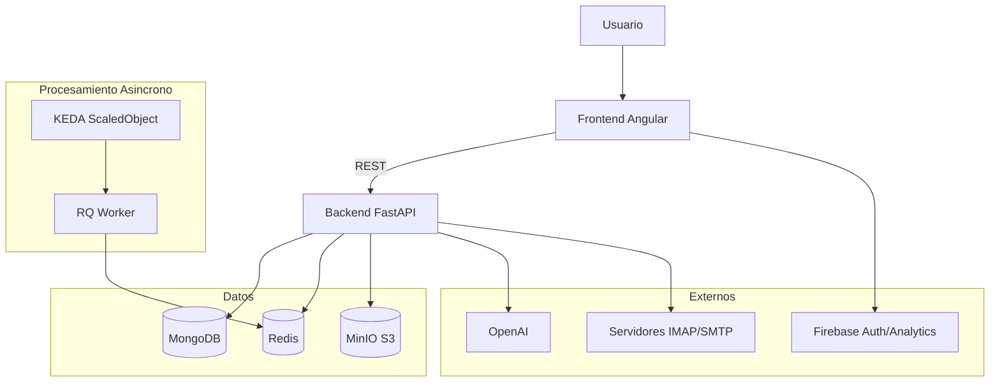
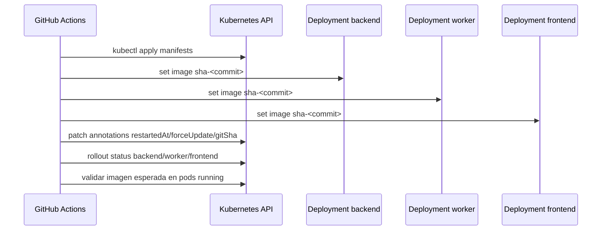

# Arquitectura de Cuenly

## Vista general

## Componentes principales

- Frontend: Angular 17, autenticacion Firebase, consumo de API backend.
- Backend: FastAPI, procesamiento de facturas, scheduler interno y APIs administrativas.
- Worker: proceso `cuenly-worker` con RQ para colas `high`, `default` y `low`.
- Redis: cache y broker de colas de jobs.
- MongoDB: persistencia principal de usuarios, facturas, configuraciones y jobs.
- MinIO: respaldo de documentos originales.
- KEDA: autoscaling del worker por CPU y longitud de cola Redis.

## Namespaces Kubernetes

- `cuenly-backend`: backend, worker, redis y recursos asociados.
- `cuenly-frontend`: frontend y recursos web.
- `cuenly-monitoring`: Prometheus, Grafana, Loki y AlertManager.

## Flujo de despliegue

