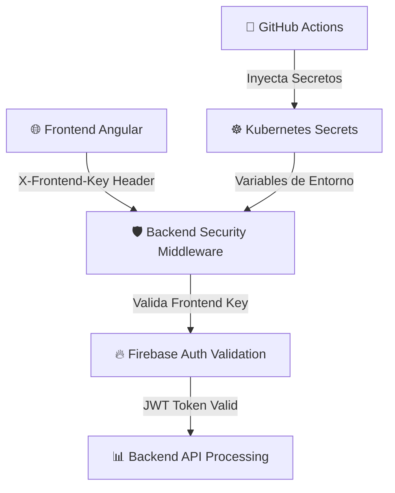

# 🔐 Implementación de Frontend API Key - Sistema de Autenticación Segura

## 📋 Resumen

Se ha implementado un sistema completo de autenticación mediante **Frontend API Key** para asegurar la comunicación entre el frontend Angular y el backend FastAPI, agregando una capa adicional de seguridad sobre el sistema existente de Firebase Authentication.

## 🏗️ Arquitectura de Seguridad



## 🔧 Componentes Implementados

### 1. **Backend Security Middleware** (`backend/app/utils/security.py`)

```python
from fastapi import HTTPException, Header
from backend.app.config.settings import settings
import logging

logger = logging.getLogger(__name__)

async def validate_frontend_key(x_frontend_key: str = Header(None, alias="X-Frontend-Key")):
    """
    Valida que las requests del frontend incluyan el Frontend API Key correcto
    """
    if not x_frontend_key:
        logger.warning("🚫 Request sin Frontend API Key")
        raise HTTPException(
            status_code=401,
            detail="Frontend API Key requerido"
        )
    
    if x_frontend_key != settings.FRONTEND_API_KEY:
        logger.warning(f"🚫 Frontend API Key inválido: {x_frontend_key[:8]}...")
        raise HTTPException(
            status_code=401,
            detail="Frontend API Key inválido"
        )
    
    logger.debug("✅ Frontend API Key válido")
    return True
```

### 2. **API Endpoints Protegidos** (`backend/app/api/api.py`)

```python
# Endpoints críticos con validación de Frontend Key
@app.post("/process", dependencies=[Depends(validate_frontend_key)])
@app.post("/process-direct", dependencies=[Depends(validate_frontend_key)])
@app.post("/tasks/process", dependencies=[Depends(validate_frontend_key)])
```

### 3. **Frontend API Service** (`frontend/src/app/services/api.service.ts`)

```typescript
// Headers seguros con Frontend API Key
private getSecureHeaders(): HttpHeaders {
  const token = this.authService.getToken();
  return new HttpHeaders({
    'Authorization': token ? `Bearer ${token}` : '',
    'X-Frontend-Key': environment.frontendApiKey,
    'Content-Type': 'application/json'
  });
}

// Uso en métodos críticos
processEmails(processRequest: any): Observable<any> {
  return this.http.post(`${this.apiUrl}/process`, processRequest, {
    headers: this.getSecureHeaders()
  });
}
```

### 4. **Configuración de Environment** 

#### Desarrollo (`frontend/src/environments/environment.ts`):
```typescript
export const environment = {
  production: false,
  apiUrl: '',
  frontendApiKey: 'cuenly-frontend-dev-key-2025',
  firebase: { /* config */ }
};
```

#### Producción (`frontend/src/environments/environment.prod.ts`):
```typescript
export const environment = {
  production: true,
  apiUrl: '',
  frontendApiKey: '__FRONTEND_API_KEY__',  // Reemplazado por GitHub Actions
  firebase: { /* config */ }
};
```

## 🚀 Pipeline de Despliegue

### GitHub Actions Workflow (`.github/workflows/cuenly-deploy.yml`)

#### 1. **Inyección de Secretos en Frontend**:
```yaml
- name: Generate environment files with secrets
  run: |
    cat > frontend/src/environments/environment.prod.ts << 'EOF'
    export const environment = {
      production: true,
      apiUrl: '',
      frontendApiKey: "${{ secrets.FRONTEND_API_KEY }}",
      firebase: {
        apiKey: "${{ secrets.FIREBASE_API_KEY }}",
        /* ... resto de config firebase ... */
      }
    };
    EOF
```

#### 2. **Configuración de Secretos Backend**:
```yaml
- name: Create/Update backend secrets
  run: |
    kubectl create secret generic backend-env-secrets \
      --namespace=${{ env.NAMESPACE }} \
      --from-literal=FRONTEND_API_KEY="${{ secrets.FRONTEND_API_KEY }}" \
      /* ... resto de secretos ... */
```

## 🔐 Gestión de Secretos

### GitHub Secrets Requeridos:
- `FRONTEND_API_KEY`: Clave secreta para autenticar requests frontend
  - **Desarrollo**: `cuenly-frontend-dev-key-2025`
  - **Producción**: Clave compleja generada y almacenada en GitHub Secrets

### Configuración en GitHub:
1. Ir a **Settings** → **Secrets and variables** → **Actions**
2. Agregar nuevo secret: `FRONTEND_API_KEY`
3. Valor sugerido para producción: `cuenly-frontend-prod-$(openssl rand -hex 32)`

## 🛡️ Características de Seguridad

### ✅ **Protecciones Implementadas**:
- **Doble Autenticación**: Firebase JWT + Frontend API Key
- **Header Security**: Validación obligatoria de `X-Frontend-Key`
- **Logging de Seguridad**: Registro de intentos de acceso inválidos
- **Secrets Management**: Manejo seguro via GitHub Actions + Kubernetes Secrets
- **Environment Isolation**: Diferentes keys para desarrollo y producción

### 🚫 **Previene**:
- Accesos no autorizados desde aplicaciones externas
- Ataques de replay sin conocimiento de Frontend Key
- Uso del API desde scripts o aplicaciones maliciosas
- Exposición de endpoints críticos sin doble validación

## 🧪 Testing & Validación

### Endpoints Protegidos:
```bash
# ❌ Sin Frontend Key - Fallará
curl -X POST http://api.cuenly.com/process \
  -H "Authorization: Bearer $FIREBASE_TOKEN" \
  -d '{"emails": []}'

# ✅ Con Frontend Key - Exitoso  
curl -X POST http://api.cuenly.com/process \
  -H "Authorization: Bearer $FIREBASE_TOKEN" \
  -H "X-Frontend-Key: $FRONTEND_API_KEY" \
  -d '{"emails": []}'
```

### Validación en Logs:
```
🚫 Request sin Frontend API Key
🚫 Frontend API Key inválido: abc12345...
✅ Frontend API Key válido
```

## 🔄 Rollout Plan

### Fase 1: ✅ **Completado**
- [x] Implementación del middleware de seguridad
- [x] Configuración de environment files
- [x] Integración en API Service
- [x] GitHub Actions pipeline actualizado

### Fase 2: **En Producción**
- [ ] Configurar `FRONTEND_API_KEY` en GitHub Secrets
- [ ] Desplegar a producción via GitHub Actions
- [ ] Verificar logs de seguridad
- [ ] Monitorear requests rechazados

### Fase 3: **Monitoreo**
- [ ] Dashboard de métricas de seguridad
- [ ] Alertas de intentos de acceso inválidos
- [ ] Rotación periódica de Frontend API Key

## 🚨 Acciones Requeridas

### Configuración Inmediata:
1. **Generar Frontend API Key para producción**:
   ```bash
   # Generar clave segura
   openssl rand -hex 32
   ```

2. **Configurar en GitHub Secrets**:
   - Navegar a repositorio → Settings → Secrets
   - Agregar `FRONTEND_API_KEY` con valor generado

3. **Deploy a producción**:
   ```bash
   git commit -am "feat: implement frontend api key security"
   git push origin main
   ```

## 📊 Monitoreo & Métricas

### Logs de Seguridad a Monitorear:
- Requests sin Frontend API Key
- Intentos con keys inválidas  
- Volumen de requests autenticados exitosamente
- Patrones de acceso anómalos

### Alertas Sugeridas:
- +10 requests inválidas por minuto
- Nuevas IPs intentando acceso sin keys válidas
- Fallas en validación de Firebase + Frontend Key

---

## 🎯 Resultado Final

El sistema ahora requiere **doble autenticación**:
1. **Firebase JWT Token** (usuario autenticado)  
2. **Frontend API Key** (aplicación autorizada)

Esto previene ataques donde un atacante obtiene un JWT válido pero no tiene acceso a la Frontend API Key, agregando una capa crucial de seguridad a tu infraestructura de producción.