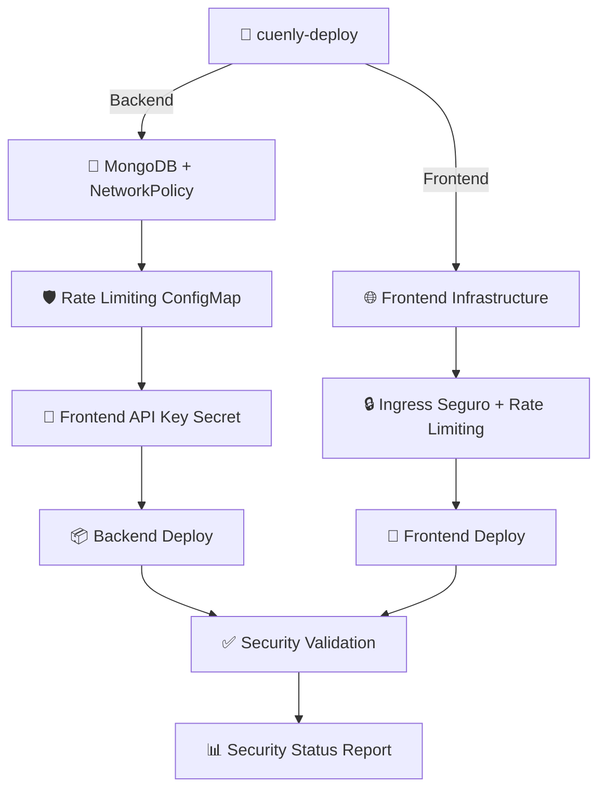

# 🛡️ Estado de Configuraciones de Seguridad - Cuenly Deploy

## 📋 Resumen de Integración

✅ **CONFIGURACIONES AUTOMÁTICAS INTEGRADAS** - Se aplicarán en cada `cuenly-deploy`

### 🔐 **1. Frontend API Key Security**
- **Backend**: Validación de `X-Frontend-Key` header en endpoints críticos
- **Frontend**: Headers seguros con API Key automática
- **Kubernetes**: Secret `FRONTEND_API_KEY` inyectado automáticamente
- **Endpoints Protegidos**: `/process`, `/process-direct`, `/tasks/process`

### 🚧 **2. Rate Limiting & Security Headers**
- **ConfigMap**: `nginx-rate-limit-config` aplicado automáticamente
- **Rate Limits**:
  - Login: `5 requests/min` (burst: 3)
  - Processing: `12 requests/hour` = 1 cada 5 minutos (burst: 2)
  - API General: `100 requests/min` (burst: 20)
  - Global: `200 requests/min` (burst: 50)
- **Connection Limits**: 20 conexiones concurrentes por IP

### 🔒 **3. Ingress Seguro**
- **SSL/TLS**: Forzado con TLS 1.2+ y ciphers seguros
- **Security Headers**:
  - `X-Frame-Options: SAMEORIGIN`
  - `X-Content-Type-Options: nosniff`
  - `X-XSS-Protection: 1; mode=block`
  - `Strict-Transport-Security: max-age=31536000`
  - `Content-Security-Policy` configurado
- **CORS Seguro**: Solo `https://app.cuenly.com`
- **Rate Limiting Global**: 100 RPS, 50 conexiones concurrentes

### 🌐 **4. Network Policies**
- **Backend**: Aislamiento de red para MongoDB y backend
- **Frontend**: Políticas de red restrictivas
- **MongoDB**: Acceso controlado solo desde backend autorizado

## 🚀 **Pipeline de Despliegue Actualizado**

### **Backend Deployment** (cuenly-backend namespace):
```yaml
1. MongoDB + Network Policies ✅
2. Rate Limiting ConfigMap ✅
3. Backend Secrets (incluye FRONTEND_API_KEY) ✅  
4. Backend Application ✅
5. Security Validation ✅
```

### **Frontend Deployment** (cuenly-frontend namespace):
```yaml
1. Frontend Infrastructure ✅
2. Ingress Seguro con Rate Limiting ✅
3. ConfigMap de Rate Limiting ✅
4. Frontend Application ✅
5. Security Health Check ✅
```

## 📊 **Monitoreo de Seguridad Automático**

El workflow ahora incluye **validación automática** al final:

```bash
🛡️  Security Status:
  ✅ Rate limiting: Configured
  ✅ Network policies: Active  
  ✅ Frontend API Key: Configured
```

## 🎯 **Configuración Requerida - GitHub Secrets**

### **Secret a agregar:**
```bash
# En GitHub Repository Secrets
FRONTEND_API_KEY = "5f4e47fc0f757c7bf20c7793c2cd8c14a29acc035ee0cb0c97213972c251ad9e"
```

### **Ubicación:**
1. `https://github.com/poravv/cuenly-app/settings/secrets/actions`
2. **New repository secret**
3. **Name:** `FRONTEND_API_KEY`
4. **Value:** La clave generada arriba

## 🔄 **Flujo de Seguridad Completo**



## 🚨 **Protecciones Implementadas**

### ✅ **Rate Limiting Inteligente**:
- **Login Bruteforce**: Máximo 5 intentos/minuto
- **Processing Abuse**: Máximo 1 proceso cada 5 minutos por IP
- **API Flooding**: Límites por endpoint y globales
- **Connection Limiting**: Previene ataques de agotamiento

### ✅ **Headers de Seguridad**:
- **XSS Protection**: Previene ataques de cross-site scripting
- **Clickjacking Protection**: X-Frame-Options configurado
- **MIME Sniffing**: Previene ataques de tipo MIME
- **HSTS**: Fuerza HTTPS por 1 año

### ✅ **Network Security**:
- **Micro-segmentación**: Pods aislados por NetworkPolicy
- **Zero Trust**: Solo conexiones autorizadas entre servicios
- **MongoDB Isolation**: Base de datos aislada del exterior

### ✅ **Authentication & Authorization**:
- **Double Auth**: Firebase JWT + Frontend API Key
- **Request Validation**: Headers obligatorios para endpoints críticos
- **Secrets Management**: Kubernetes Secrets + GitHub Actions

## 📈 **Beneficios de Seguridad**

1. **Prevención de Ataques**:
   - ❌ Brute force en login
   - ❌ Flooding de requests de procesamiento
   - ❌ Acceso no autorizado a APIs críticas
   - ❌ Ataques XSS y clickjacking

2. **Monitoreo Automático**:
   - 📊 Logs de rate limiting
   - 🚨 Alertas de seguridad
   - 📈 Métricas de requests rechazados

3. **Compliance**:
   - 🔐 HTTPS forzado
   - 🛡️ Headers de seguridad estándar
   - 🌐 CORS restrictivo
   - 🔒 Secrets management seguro

---

## 🎯 **Próximos Pasos**

1. **Configurar GitHub Secret**: `FRONTEND_API_KEY`
2. **Deploy a producción**: `git push origin main`
3. **Verificar logs de seguridad**: Monitorear requests rechazados
4. **Alertas**: Configurar alertas para patrones anómalos

**¡Tu aplicación estará completamente asegurada con despliegue automático!** 🚀🛡️