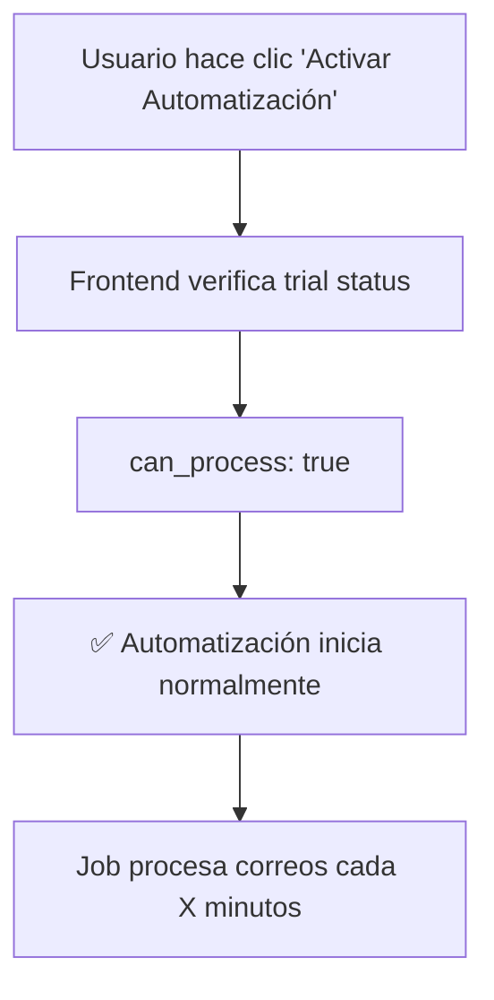
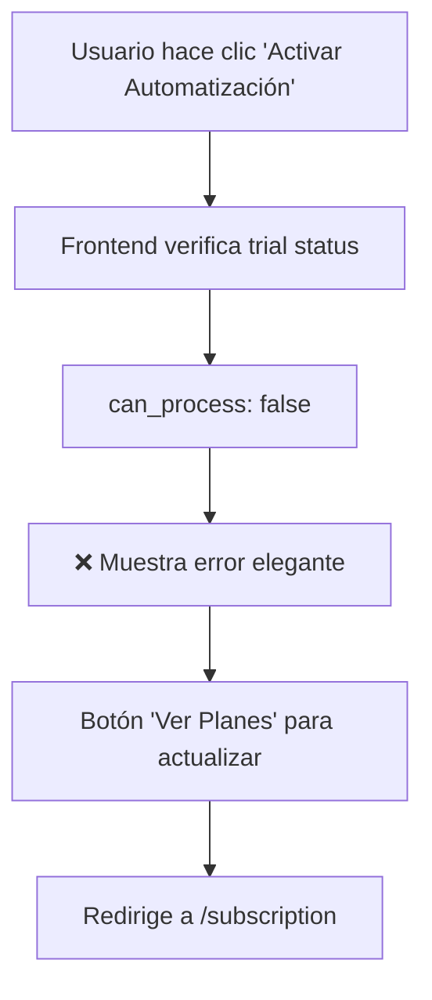
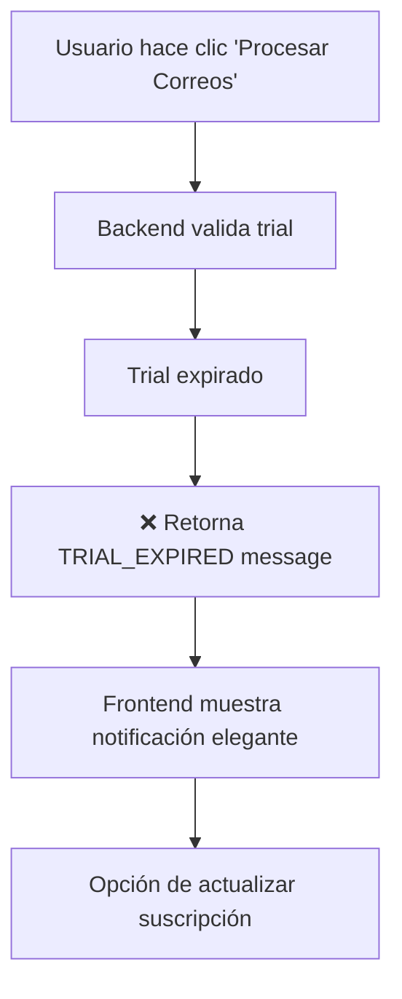

# 🎯 Implementación Completa - Control de Trial Expirado

## ✅ **Implementación Realizada**

Se ha creado un sistema completo para detectar y manejar usuarios con trial expirado que intentan usar automatización de procesamiento de correos.

## 🔧 **Backend - Nuevas Funcionalidades**

### **1. Validación en Endpoint `/process`**
```python
# Verificar trial antes de procesar
trial_info = user_repo.get_trial_info(owner_email)

if trial_info['is_trial_user'] and trial_info['trial_expired']:
    return ProcessResult(
        success=False,
        message="TRIAL_EXPIRED: Tu período de prueba ha expirado. Por favor, actualiza tu suscripción para continuar procesando facturas.",
        invoice_count=0,
        invoices=[]
    )
```

### **2. Nuevo Endpoint `/user/trial-status`**
```python
@app.get("/user/trial-status")
async def get_trial_status(user: Dict[str, Any] = Depends(_get_current_user)):
    """
    Verifica el estado del trial del usuario actual.
    Retorna información específica sobre el estado del trial para automatización.
    """
    return {
        "success": True,
        "can_process": not trial_info.get('trial_expired', True),
        "is_trial_user": trial_info.get('is_trial_user', False),
        "trial_expired": trial_info.get('trial_expired', True),
        "message": "Trial expirado. Actualiza tu suscripción para continuar." if trial_expired else "Trial activo"
    }
```

## 🎨 **Frontend - Mejoras de UX**

### **1. Verificación Pre-Automatización**
```typescript
startJob(): void {
  // Verificar trial antes de iniciar automatización
  this.apiService.getTrialStatus().subscribe({
    next: (trialStatus) => {
      if (!trialStatus.can_process) {
        this.jobError = trialStatus.message;  // Muestra error elegante
        this.jobLoading = false;
        return;
      }
      // Proceder con automatización si trial es válido
    }
  });
}
```

### **2. Detección de Errores de Trial en Procesamiento**
```typescript
processEmails(): void {
  this.apiService.processEmailsDirect().subscribe({
    next: (result) => {
      if (!result.success && result.message?.includes('TRIAL_EXPIRED')) {
        this.showTrialExpiredError(result.message);  // UI especializada
        return;
      }
    }
  });
}
```

### **3. Nuevo Método API en Frontend**
```typescript
// Verificar estado del trial del usuario
getTrialStatus(): Observable<{success: boolean, can_process: boolean, message: string}> {
  return this.http.get<any>(`${this.apiUrl}/user/trial-status`);
}
```

## 🎭 **Interfaz de Usuario Mejorada**

### **Error de Trial - Diseño Elegante**
```html
<!-- Error State - Trial Expirado -->
<div *ngIf="error?.includes('🚫')" class="alert alert-warning border-0">
  <div class="d-flex align-items-start">
    <i class="bi bi-hourglass-split text-warning me-2 fs-5"></i>
    <div class="flex-grow-1">
      <h6 class="alert-heading mb-2">Período de Prueba Expirado</h6>
      <p class="mb-2">{{ error.replace('🚫 ', '') }}</p>
      <div class="d-flex gap-2">
        <button class="btn btn-sm btn-warning" routerLink="/subscription">
          <i class="bi bi-credit-card me-1"></i>Ver Planes
        </button>
        <button class="btn btn-sm btn-outline-secondary" (click)="error = null">
          <i class="bi bi-x me-1"></i>Cerrar
        </button>
      </div>
    </div>
  </div>
</div>
```

## 📊 **Flujo de Funcionamiento**

### **Caso 1: Usuario con Trial Válido**


### **Caso 2: Usuario con Trial Expirado** 


### **Caso 3: Procesamiento Manual con Trial Expirado**


## 🛡️ **Protecciones Implementadas**

### **✅ Backend:**
- Validación de trial en endpoints críticos (`/process`)
- Logs de seguridad para intentos con trial expirado
- Respuestas consistentes con prefijo `TRIAL_EXPIRED:`
- Nuevo endpoint específico para verificar estado

### **✅ Frontend:**
- Verificación previa antes de iniciar automatización
- Detección de errores de trial en respuestas del backend
- UI diferenciada para errores de trial vs errores técnicos
- Auto-limpieza de notificaciones después de 10 segundos
- Botones de acción directa (Ver Planes, Cerrar)

### **✅ UX/UI:**
- Iconografía apropiada (⏳ reloj de arena para trial)
- Colores diferenciados (warning amarillo vs error rojo)
- Mensajes claros y accionables
- Flujo directo hacia actualización de suscripción

## 📋 **Logs de Seguimiento**

### **Logs Backend:**
```bash
INFO:app.modules.email_processor.config_store:Omitiendo configuración de andyvercha@gmail.com - trial expirado
WARNING:backend:Intento de procesamiento con trial expirado: andyvercha@gmail.com
INFO:app.modules.email_processor.email_processor:Iniciando procesamiento de 0 cuentas (filtradas por trial válido)
```

### **Comportamiento Frontend:**
```bash
✅ Usuario con trial válido: Automatización inicia normalmente
❌ Usuario con trial expirado: Muestra notificación elegante con botón de actualización
🔄 Auto-limpieza: Notificaciones desaparecen después de 10 segundos
```

## 🎯 **Resultado Final**

### **Antes:**
- Usuario con trial expirado podía intentar iniciar automatización
- Job se iniciaba pero no procesaba nada (confuso)
- Sin feedback claro sobre por qué no funcionaba

### **Después:**
- ✅ **Prevención**: No permite iniciar automatización si trial expiró
- ✅ **Detección**: Detecta intentos de procesamiento con trial expirado  
- ✅ **Comunicación**: Mensaje claro y elegante con call-to-action
- ✅ **Acción**: Botón directo para ver planes y actualizar suscripción
- ✅ **Logs**: Seguimiento completo para administración

---

## 🚀 **Próximo Deploy**

Con esta implementación, cuando un usuario con trial expirado intente usar automatización:

1. **Será bloqueado** antes de que el job inicie
2. **Verá un mensaje elegante** explicando la situación
3. **Tendrá acceso directo** a actualizar su suscripción
4. **Los logs** registrarán el intento para seguimiento

**¡El sistema ahora protege completamente contra uso no autorizado y guía al usuario hacia la actualización de manera elegante!** ✨🎯