# Cuenly Enterprise — Arquitectura del Sistema

## Visión General

Cuenly Enterprise es una plataforma de **procesamiento automático de facturas electrónicas** orientada a empresas B2B en Paraguay. El sistema ingiere facturas desde correo electrónico (IMAP), las almacena en la nube (MinIO), las encola en RabbitMQ y las procesa de forma asíncrona extraendo datos estructurados del formato SIFEN (SET Paraguay).

---

## Diagrama de Arquitectura General

```mermaid
graph TB
    subgraph INGESTION["📧 Capa de Ingestión"]
        IMAP[("Servidor IMAP\nGmail / Outlook / etc.")]
        JOB["ImapProcessingJob\n@Scheduled cada 60s"]
        MINIO[("MinIO\nObject Storage")]
    end

    subgraph QUEUE["🐇 Cola Asíncrona"]
        MQ[("RabbitMQ\ncuenly.invoice.process.queue")]
        CONSUMER["InvoiceQueueConsumer\n@RabbitListener"]
    end

    subgraph PARSING["⚙️ Parsers"]
        XML_PARSER["SifenXmlInvoiceParser\nFormat rDE v150"]
        AI_PARSER["AI Vision (OpenAI)\nPDF / Imagen"]
        SUBJECT["SubjectMatcherService\nFiltro acentos + keywords"]
    end

    subgraph STORAGE["💾 Persistencia"]
        MONGO[("MongoDB\ncolección: invoices")]
        MONGO_IMAP[("MongoDB\ncolección: imap_accounts")]
    end

    subgraph ADMIN["🖥️ Panel Admin"]
        DASH["Dashboard\nMétricas en tiempo real"]
        SETTINGS["Settings\nIMAP + Keywords + Jobs"]
        FRONTEND["Next.js Frontend :3000"]
    end

    subgraph BACKEND["☕ Backend (Spring Boot :8080)"]
        CTRL_METRICS["MetricsController\nGET /api/admin/metrics/*"]
        CTRL_IMAP["ImapAccountController\nCRUD /api/admin/imap"]
        CTRL_JOBS["ImapJobControlController\nGET/POST /api/admin/jobs/*"]
    end

    IMAP -->|"Poll emails"| JOB
    JOB -->|"Filter by keywords"| SUBJECT
    JOB -->|"Upload attachment"| MINIO
    JOB -->|"Publish message"| MQ
    MQ -->|"Consume"| CONSUMER
    CONSUMER -->|"XML"| XML_PARSER
    CONSUMER -->|"PDF/IMG + OpenAI key"| AI_PARSER
    CONSUMER -->|"No OpenAI → PENDING_AI"| MONGO
    XML_PARSER -->|"Structured data"| MONGO
    AI_PARSER -->|"Extracted data"| MONGO
    MONGO_IMAP -->|"Account config"| JOB

    FRONTEND --> CTRL_METRICS
    FRONTEND --> CTRL_IMAP
    FRONTEND --> CTRL_JOBS
    CTRL_METRICS --> MONGO
    CTRL_METRICS --> MQ
    CTRL_IMAP --> MONGO_IMAP
    CTRL_JOBS --> JOB
```



---

## Diagrama de Flujo — Procesamiento de una Factura

```mermaid
sequenceDiagram
    participant Email as 📧 Email Server
    participant Job as ⏰ ImapProcessingJob
    participant Matcher as 🔍 SubjectMatcher
    participant MinIO as 🗄️ MinIO Storage
    participant MQ as 🐇 RabbitMQ
    participant Consumer as ⚙️ QueueConsumer
    participant Parser as 📄 SifenParser / AI
    participant DB as 🍃 MongoDB

    Note over Job: @Scheduled cada 60 segundos
    Job->>Email: Connect IMAP, fetch UNSEEN
    Email-->>Job: List<Message>
    Job->>Matcher: matches(subject, keywords)?
    alt Subject no coincide
        Matcher-->>Job: false → skip
    else Subject coincide
        Matcher-->>Job: true → process
        Job->>Email: Get attachments (.xml/.pdf/.jpg)
        Job->>MinIO: uploadRawInvoice(companyId, bytes)
        MinIO-->>Job: minioKey
        Job->>MQ: publish(InvoiceProcessingMessage)
        Job->>Email: Mark as READ
        MQ->>Consumer: consume(message)
        alt fileType == XML
            Consumer->>Parser: parse(xmlBytes)
            Parser-->>Consumer: Map<fields>
            Consumer->>DB: save(status=DONE)
        else fileType == PDF/IMAGE
            alt OpenAI configurado
                Consumer->>Parser: vision(bytes)
                Parser-->>Consumer: extracted data
                Consumer->>DB: save(status=DONE)
            else OpenAI NOT configurado
                Consumer->>DB: save(status=PENDING_AI)
                Note over Consumer: ⚠️ Log warning + hint
            end
        end
    end
```



---

## Componentes del Sistema

### Backend (Spring Boot 3, Java 21)

| Clase | Paquete | Responsabilidad |
|-------|---------|-----------------|
| `ImapProcessingJob` | `invoice.application` | Polling IMAP, filtrado, upload MinIO, publish queue |
| `SubjectMatcherService` | `invoice.application` | Filtro de asuntos con normalización de acentos |
| `InvoiceQueueConsumer` | `invoice.application` | Consumer RabbitMQ, routing XML/AI |
| `SifenXmlInvoiceParser` | `invoice.application` | Parser nativo SIFEN rDE v150 |
| `InvoiceProcessingMessage` | `invoice.application` | DTO de mensajes de cola |
| `ImapAccount` | `invoice.domain` | Entidad de cuenta IMAP con config de keywords |
| `InvoiceLineItem` | `invoice.domain` | Línea de item de factura (SIFEN gCamItem) |
| `MongoInvoiceDocument` | `…persistence` | Documento MongoDB con todos los campos SIFEN |
| `MinioCloudStorageAdapter` | `…persistence` | Implementación del puerto `CloudStoragePort` |
| `MetricsController` | `infrastructure.admin` | API de métricas de dashboard |
| `ImapAccountController` | `…adapter.in.web` | CRUD de cuentas IMAP |
| `ImapJobControlController` | `infrastructure.admin` | Control de lifecycle del job IMAP |

### Frontend (Next.js 14, React)

| Página | Ruta | Descripción |
|--------|------|-------------|
| Dashboard | `/admin` | Métricas en tiempo real (queue, invoices, AI status) |
| Settings | `/admin/settings` | Admin key, IMAP accounts + keywords, Job control |

### Infraestructura (Docker Compose)

| Servicio | Puerto | Descripción |
|----------|--------|-------------|
| `backend` | 8080 | Spring Boot API |
| `frontend` | 3000 | Next.js dashboard |
| `mongo` | 27017 | Base de datos principal |
| `rabbitmq` | 5672 / 15672 | Cola de mensajes |
| `minio` | 9000 / 9001 | Object storage (archivos de facturas) |
| `redis` | 6379 | Cache / sesiones |

---

## Configuración Requerida (`.env`)

```env
# MongoDB
MONGO_URI=mongodb://mongo:27017/cuenly

# RabbitMQ
RABBITMQ_HOST=rabbitmq
rabbitmq.queue.invoice-processing=cuenly.invoice.process.queue

# MinIO
infrastructure.storage.minio.url=http://minio:9000
infrastructure.storage.minio.access-key=minio
infrastructure.storage.minio.secret-key=minio123
infrastructure.storage.minio.bucket=invoices

# Seguridad
app.security.admin-api-key=SUPERSECUREADMINKEY

# OpenAI (opcional — habilita procesamiento PDF/Imagen)
app.openai.api-key=sk-...
```

---

## Estados de Procesamiento de Facturas

```mermaid
stateDiagram-v2
    [*] --> PROCESSING: Mensaje consumido del queue
    PROCESSING --> DONE: XML parseado ✅\nAI procesado ✅
    PROCESSING --> PENDING_AI: PDF/Imagen sin API Key ⚠️
    PROCESSING --> FAILED: Error irrecuperable ❌
    PENDING_AI --> DONE: Re-proceso manual (futuro)
    FAILED --> [*]
    DONE --> [*]
```


