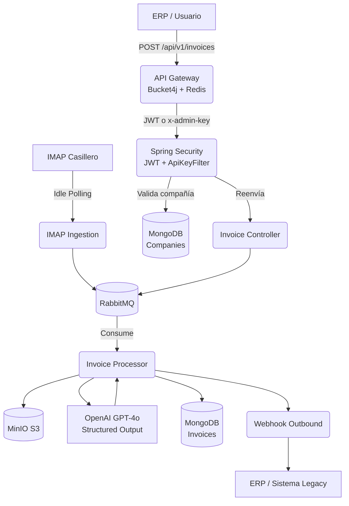

# Cuenly Enterprise B2B — Backend

Microservicio corporativo de procesamiento avanzado de facturas B2B con extracción vía IA, autenticación JWT, gestión de usuarios administradores y clientes M2M.

Construido con **Spring Boot 4 (Java 21)** siguiendo **Arquitectura Hexagonal (Ports & Adapters)**.

---

## 🏗 Arquitectura de Software

### Capas
| Capa | Descripción |
|---|---|
| `domain` | Modelos de negocio puros (`Invoice`, `CompanyPrincipal`, etc.) |
| `application` | Casos de uso e interfaces (puertos) |
| `infrastructure` | Adaptadores concretos: REST, MongoDB, RabbitMQ, OpenAI, MinIO, Seguridad |

### Flujo Operativo



---

## 🔒 Seguridad & Autenticación

El sistema soporta **dos mecanismos de autenticación en paralelo**:

### 1. JWT (Administración del Dashboard)
- **Endpoint de login:** `POST /api/auth/login`
- **Respuesta:** `{ token, username, email, role }`
- **Uso:** `Authorization: Bearer <token>`
- **Expiración:** configurable vía `APP_JWT_EXPIRATION_MINUTES` (default: 480 min)
- **Algoritmo:** HMAC-SHA512 (JJWT 0.12.x)
- **Roles:** `ADMIN`, `SUPER_ADMIN`

### 2. M2M (Machine-to-Machine — para jobs y cronjobs externos)
- **Endpoint:** `POST /api/auth/token`
- **Body:** `{ "clientId": "...", "clientSecret": "..." }`
- **Respuesta:** `{ token, type: "m2m", clientId }`
- Útil para servicios de integración, pipelines y workers externos

### 3. x-admin-key (deprecado — backward compat)
- Sigue soportado por `ApiKeyAuthFilter` para compatibilidad
- Se recomienda migrar a JWT

### Endpoints públicos (sin auth)
```
POST /api/auth/login
POST /api/auth/token
GET  /actuator/**
```

---

## 👤 Seeding del Admin por Defecto

Al iniciar la aplicación por primera vez, `AdminUserSeeder` crea automáticamente:
1. **Un usuario SUPER_ADMIN** (si no existe en MongoDB)
2. **Un cliente M2M** (si no existe en MongoDB)

Las credenciales se leen desde el `.env`. Una vez creados en base de datos, el `.env` ya no tiene efecto sobre ellos.

```bash
# Verificar seeding en logs
docker logs cuenly-enterprise-backend | grep Seeder
```

---

## 📡 Endpoints de Administración

### Autenticación
| Método | Ruta | Auth | Descripción |
|---|---|---|---|
| POST | `/api/auth/login` | — | Login usuario admin → JWT |
| POST | `/api/auth/token` | — | Login M2M → JWT |

### Gestión de Usuarios (solo SUPER_ADMIN)
| Método | Ruta | Descripción |
|---|---|---|
| GET | `/api/admin/users` | Listar admins |
| POST | `/api/admin/users` | Crear admin |
| PATCH | `/api/admin/users/{id}/password` | Reset contraseña |
| PATCH | `/api/admin/users/{id}/enabled` | Activar/desactivar |
| DELETE | `/api/admin/users/{id}` | Eliminar admin |

### Gestión de Clientes M2M
| Método | Ruta | Descripción |
|---|---|---|
| GET | `/api/admin/m2m-clients` | Listar clientes |
| POST | `/api/admin/m2m-clients` | Crear cliente |
| PATCH | `/api/admin/m2m-clients/{id}/enabled` | Activar/desactivar |
| PATCH | `/api/admin/m2m-clients/{id}/rotate-secret` | Rotar secret |
| DELETE | `/api/admin/m2m-clients/{id}` | Eliminar cliente |

---

## ⚙️ Variables de Entorno (.env)

```dotenv
# MongoDB
MONGO_URI=mongodb://mongo:27017/cuenlyapp_warehouse_b2b

# JWT
APP_JWT_SECRET=<min-32-chars-secret>
APP_JWT_EXPIRATION_MINUTES=480

# Admin por defecto (solo para seed inicial)
DEFAULT_ADMIN_USERNAME=admin
DEFAULT_ADMIN_EMAIL=admin@cuenly.com
DEFAULT_ADMIN_PASSWORD=Admin1234!

# Cliente M2M por defecto (solo para seed inicial)
M2M_CLIENT_ID=backend-service
M2M_CLIENT_SECRET=<tu-secret-seguro>

# OpenAI
OPENAI_API_KEY=sk-...
OPENAI_MODEL=gpt-4o

# MinIO
MINIO_URL=http://minio:9000
MINIO_ACCESS_KEY=minioadmin
MINIO_SECRET_KEY=minioadmin
MINIO_BUCKET=cuenly-invoices

# RabbitMQ
RABBITMQ_HOST=rabbitmq
RABBITMQ_PORT=5672
RABBITMQ_USER=guest
RABBITMQ_PASSWORD=guest
```

---

## 🛠 Entorno de Desarrollo Local

```bash
# Levantar infraestructura (Mongo, Redis, MinIO, RabbitMQ)
docker compose up mongo redis minio rabbitmq -d

# Ejecutar el backend localmente
./mvnw spring-boot:run
```

---

## 🚢 Docker & Despliegue

```bash
# Build + start completo (usar legacy builder para evitar EPERM de buildx)
DOCKER_BUILDKIT=0 COMPOSE_DOCKER_CLI_BUILD=0 docker compose up --build -d

# O simplemente (si Docker Desktop no tiene el bug de buildx)
docker compose up --build -d
```

El `Dockerfile` es **multi-stage**: compila con JDK 21 y empaca en `eclipse-temurin:21-jre-jammy` sin permisos root.

---

## ✅ Tests

```bash
./mvnw test
```
