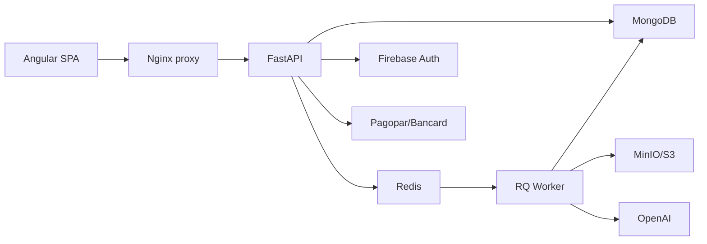

# Arquitectura Técnica CuenlyApp

## Resumen

CuenlyApp es una aplicación Angular + FastAPI con persistencia MongoDB, colas Redis/RQ y autenticación Firebase. El backend expone APIs REST para procesamiento de facturas, configuración de correos, consultas, administración y suscripciones Pagopar.

## Componentes


```mermaid
flowchart LR
  Browser["Angular SPA"] --> Nginx["Nginx proxy"]
  Nginx --> API["FastAPI"]
  API --> Mongo["MongoDB"]
  API --> Redis["Redis"]
  Redis --> Worker["RQ Worker"]
  Worker --> Mongo
  Worker --> MinIO["MinIO/S3"]
  API --> Firebase["Firebase Auth"]
  API --> Pagopar["Pagopar/Bancard"]
  Worker --> OpenAI["OpenAI"]
```

## Backend

Punto de entrada: `backend/app/api/api.py`.

Routers activos:

- Procesamiento y tareas: `/process`, `/process-direct`, `/tasks/*`, `/jobs/*`, `/job/*`.
- Uploads: `/upload`, `/upload-xml`, `/upload-image`, `/tasks/upload-pdf`, `/tasks/upload-xml`.
- Facturas: `/v2/invoices/*`, `/invoices/*`, `/export/*`.
- Configuración de correo: `/email-config*`, `/email-configs*`.
- Usuario: `/user/*` y aliases puntuales `/api/user/profile`.
- Colas visibles al usuario: `/user/queue-events`, `/user/queue-events/stream`, `/user/queue-events/{id}/retry`.
- Suscripciones: `/subscriptions/*`.
- Pagopar legacy: `/pagopar/*`.
- Admin: `/admin/*`.
- Sistema: `/health`, `/status`, `/metrics`, `/logs/frontend`.

Autenticación:

- La mayoría de endpoints protegidos usan Firebase Bearer token mediante `_get_current_user`.
- Endpoints administrativos usan `_get_current_admin` y validan Firestore `admins`.
- Endpoints de procesamiento manual sensibles validan además `X-Frontend-Key`.
- SSE usa token en query param porque `EventSource` no permite headers custom.

## Frontend

Puntos principales:

- API client general: `frontend/src/app/services/api.service.ts`.
- Perfil, cola y acciones de usuario: `frontend/src/app/services/user.service.ts`.
- Auth Firebase: `frontend/src/app/services/auth.service.ts`.
- Interceptores: `auth.interceptor.ts`, `trial.interceptor.ts`, `observability.interceptor.ts`.

Convención operativa:

- `environment.apiUrl` debe quedar vacío en local/prod con proxy.
- Las rutas relativas permiten que `AuthInterceptor` agregue `Authorization`.
- `/api/*` se usa como alias público del frontend y se reescribe a `/*` en proxy/nginx.

Proxy:

- Local Angular: `frontend/proxy.conf.json`.
- Docker/Kubernetes: `frontend/nginx.template.conf`.
- El compose estándar y CI usan `frontend/Dockerfile.proxy`.
- `/logs/frontend`, `/dashboard/*` y `/pagopar/*` deben quedar cubiertos por proxy para no caer en el fallback SPA.

## Colas y Procesamiento

RQ usa tres colas Redis:

- `high`: acciones manuales, rango histórico y jobs urgentes.
- `default`: procesamiento normal.
- `low`: tareas de baja prioridad.

Archivos clave:

- Worker: `backend/worker.py`.
- Encolado/estado/cancelación: `backend/app/worker/queues.py`.
- Jobs ejecutables: `backend/app/worker/jobs.py`.
- Cola local legacy: `backend/app/modules/scheduler/task_queue.py`.

Flujos principales:

- `POST /tasks/process`: encola procesamiento de correos del usuario.
- `POST /jobs/process-range`: cancela jobs de rango previos del mismo usuario y encola uno nuevo.
- `GET /tasks/{job_id}`: normaliza estados RQ a `queued`, `running`, `done`, `error`.
- `POST /tasks/{job_id}/cancel`: cancela jobs en cola o solicita stop remoto si están corriendo.
- `GET /user/queue-events/stream`: expone eventos Mongo + jobs RQ sintéticos para que la UI no aparezca vacía durante discovery.

## Pagos y Suscripciones

Suscripciones:

- Públicas: `/subscriptions/plans`, `/subscriptions/ensure-customer`, `/subscriptions/subscribe`, `/subscriptions/confirm-card`.
- Usuario: `/subscriptions/my-subscription`, `/subscriptions/my-transactions`, `/subscriptions/payment-methods`, `/subscriptions/cancel`.
- Admin: `/admin/subscriptions/*`.

Pagopar:

- Servicio: `backend/app/services/pagopar_service.py`.
- Endpoints legacy/diagnóstico: `backend/app/api/endpoints/pagopar.py`.
- Billing recurrente: `backend/app/modules/scheduler/jobs/subscription_billing_job.py`.

El cobro inicial se intenta de forma síncrona al suscribirse si ya existe tarjeta. Si no hay tarjeta, se inicia catastro y la confirmación activa la suscripción y registra la primera transacción.

El billing recurrente corre diariamente, toma suscripciones `active`/`past_due` con `next_billing_date <= now`, crea pedido Pagopar, obtiene `alias_token`, cobra y registra transacción. Usa lock Redis para evitar ejecución simultánea entre pods.

## Base de Datos

MongoDB principal: `settings.MONGODB_DATABASE`.

Colecciones críticas:

- `auth_users`: perfil, trial, límites IA.
- `invoice_headers`, `invoice_items`: facturas v2.
- `processed_emails`: idempotencia y eventos de cola.
- `email_configs`: cuentas IMAP/OAuth.
- `subscription_plans`, `user_subscriptions`, `payment_methods`, `subscription_transactions`: planes y pagos.

## Riesgos Auditados

- Frontend debe mantener rutas relativas; rutas absolutas evitan el interceptor de auth.
- `/api/*` debe reescribirse en todos los proxies para no depender de aliases incompletos en backend.
- Los jobs de rango deben evitar solapamiento por usuario; el backend cancela jobs activos previos.
- Billing recurrente debe correr con lock Redis; si Redis cae, el fallback asume single-pod.
- `environment.sample.ts` debe incluir `frontendApiKey` para que builds de referencia no queden desalineados.

## Verificación Rápida

```bash
python3 -m py_compile backend/app/api/api.py backend/app/api/routers/processing.py backend/app/api/endpoints/subscriptions.py backend/app/api/endpoints/pagopar.py
cd frontend && npm run build
```
