# Documentación Técnica y Arquitectura de CuenlyApp

Esta documentación detalla la arquitectura técnica, estructura de datos, componentes del sistema, integración de pagos e infraestructura de Cuenly.

---

## 🏗️ 1. Arquitectura General del Sistema

El sistema utiliza una arquitectura de microservicios contenerizada con Kubernetes en producción y Docker en desarrollo.


### 1.1 Diagrama de Frontend (Angular 17)

```mermaid
graph TB
    subgraph "🅰️ Angular Application"
        APP[App Component] --> ROUTER[Router / Guards]
        APP --> NOTIFICATION[Notification Container]
    end
    
    ROUTER --> PUBLIC[Public: Login, Trial]
    ROUTER --> MAIN[Main: Dashboard, Invoices Grid]
    ROUTER --> TOOLS[Tools: Email, Templates, Subscription]
    ROUTER --> ADMIN[Admin: Users, Plans, AI Limits]
    
    MAIN --> API_SERVICE[API Service]
    TOOLS --> API_SERVICE
    ADMIN --> API_SERVICE
    
    API_SERVICE --> BACKEND[FastAPI Backend]
    PUBLIC --> FIREBASE_EXT[Firebase Auth]
```



### 1.2 Diagrama de Backend (FastAPI / Python 3.11)


---

## 🗄️ 2. Estructura de Base de Datos (MongoDB)


---

## 🚀 3. Procesamiento y Extracción de Datos

### 3.1 Arquitectura de Alto Rendimiento (Fan-out)
Para evitar bloqueos en el backend, el procesamiento se divide en dos fases:
- **Fase de Descubrimiento (Discovery)**: El API busca UIDs de correos, descarga metadatos básicos (Asunto, Remitente, Fecha) en bloque y registra el correo como `pending` en MongoDB. Esta fase toma segundos.
- **Fase de Fan-out**: Cada correo descubierto se encola como una tarea independiente en **BullMQ/RQ**.
- **Fase de Procesamiento**: Los Workers procesan cada tarea: descargan el contenido completo (FETCH), extraen adjuntos y ejecutan la lógica de IA.

### 3.2 Optimización IMAP y Conexiones
- **Connection Pooling**: Se mantiene un pool de conexiones IMAP persistentes para evitar el overhead del handshake SSL en cada request (reducción del 70% en tiempo de conexión).
- **Gestión de Estados**: El sistema garantiza que las conexiones reutilizadas se encuentren en estado `SELECTED` (vía `SELECT "INBOX"`) antes de cualquier operación de lectura.
- **Prioridad XML**: El sistema intenta leer archivos XML primero usando un parser nativo SIFEN (para Facturación Electrónica en Paraguay). Si falla o falta data, usa GPT-4o como respaldo.
- **Imágenes / PDF**: Se extraen los adjuntos (o se descargan desde enlaces), se almacenan los originales en MinIO (bucket privado) y se usa GPT-4o Vision para pasarlos a estructura JSON.
- **Seguridad de Archivos**: Uso de `python-magic` (Magic Numbers) para validar que no sean ejecutables o scripts maliciosos ocultos bajo extensiones `.pdf`.

### 3.3 Idempotencia Global (Anti-Duplicados)
- **Reserva atómica por correo (`processed_emails`)**:
  - Antes de procesar un UID, el sistema realiza un `claim` atómico (`status=processing`) en `processed_emails`.
  - Si el correo ya estaba reservado/procesado por cualquier método (botones manual, async o rango), se omite.
  - Solo estados explícitamente reintentables (`skipped_ai_limit`, `skipped_ai_limit_unread`, `retry_requested`) pueden reclamarse de nuevo.
- **Control por `Message-ID`**:
  - Se guarda el `message_id` RFC822 del correo.
  - Si aparece otro correo con el mismo `Message-ID` para el mismo owner, se marca como duplicado y se evita reproceso.
- **No duplicación en Mongo (`invoice_headers` / `invoice_items`)**:
  - Persistencia canónica por `owner_email + cdc` (prioridad principal).
  - Fallback por `owner_email + message_id` cuando no hay CDC.
  - Índice único parcial en `(owner_email, cdc)` para reforzar unicidad en base de datos.
  - En caso de reingreso del mismo documento, se actualiza (`upsert`) el registro existente en lugar de crear uno nuevo.

---

## 💳 4. Integración Detallada con PAGOPAR (Suscripciones)

El sistema soporta cobros recurrentes en Paraguay usando la pasarela **Pagopar (Bancard)** mediante un esquema de Catastro de Tarjetas.

### 4.1. Flujo de Activación
1. **Frontend**: El usuario elige un plan y llama al endpoint `/subscriptions/subscribe`.
2. **Backend**:
   - Genera token: `sha1(PRIVATE_KEY + "PAGO-RECURRENTE")`.
   - Crea un cliente (endpoint `/agregar-cliente/`).
   - Solicita inicio de catastro (endpoint `/agregar-tarjeta/`).
   - Retorna un `form_id` al frontend.
3. **Frontend**: Carga el script de Bancard Checkout usando el `form_id` en un iframe.
4. **Al completarse (Confirmación)**: El frontend llama a `/subscriptions/confirm-card`, el backend confirma con Pagopar (`/confirmar-tarjeta/`) y activa el plan en la base de datos (`USER_SUBSCRIPTIONS.status = 'ACTIVE'`).

### 4.2. Job de Cobro Diario (Cron)
1. **Condición**: Un script diario revisa `user_subscriptions` donde `status = 'ACTIVE'` y `next_billing_date <= hoy`.
2. **Ejecución (por usuario)**:
   - Se crea y firma un nuevo ticket de venta `VENTA-COMERCIO`. Hash: `sha1(PRIVATE_KEY + ID_PEDIDO + MONTO)`.
   - Llama a `/listar-tarjeta/` para conseguir un `alias_token` (válido por 15 min).
   - Llama a `/pagar/` usando el `alias_token` y el hash del ticket.
3. **Manejo de Respuestas**:
   - Éxito: Se cobra la cuota inicial de forma síncrona y se actualiza `next_billing_date` sumando 30 días.
   - Fallo: Se aborta la operación.

### 4.2. Job de Cobro Diario (Cron)
1. **Condición**: Un script diario revisa `user_subscriptions` donde `status = 'ACTIVE'` y `next_billing_date <= hoy`.
2. **Ejecución (por usuario)**:
   - Se crea y firma un nuevo ticket de venta `VENTA-COMERCIO`. Hash: `sha1(PRIVATE_KEY + ID_PEDIDO + MONTO)`.
   - Llama a `/listar-tarjeta/` para conseguir un `alias_token` (válido por 15 min).
   - Llama a `/pagar/` usando el `alias_token` y el hash del ticket.
3. **Manejo de Respuestas**:
   - Éxito: Se actualiza `next_billing_date` sumando 30 días.
   - Fallo: Se marca como `PAST_DUE` (moroso). Puede tener reintentos programados (ej. día 1, 3 y 7).

---

## 🛡️ 5. Seguridad y Despliegue en Kubernetes

El despliegue está administrado mediante **GitHub Actions** (`cuenly-deploy.yml`), el cual actualiza contenedores, aplica rate limiting y sincroniza variables (secrets).

### 5.1 Entorno de Red y Endpoints Seguros
- **API Key**: Las rutas críticas (`/process`, etc.) requieren `X-Frontend-Key` que coincide con el `FRONTEND_API_KEY` inyectado vía Secret en Kubernetes.
- **Rate Limiting Global (Nginx Ingress)**: 
  - Login: 5 req/min.
  - Procesamiento pesado: 1 req/5 min.
  - Ocurrencias concurrentes IP limitadas a 20.
- **Cabeceras SSL/TLS**: HSTS, Protección XSS (`mode=block`), `nosniff`, etc. Solo admite CORS de `https://app.cuenly.com`.
- **Database Isolation**: NetworkPolicies aíslan a MongoDB para que solo el backend pueda hacer consultas. Ninguna exposición exterior.

### 5.2 Comandos de Despliegue Rápido (Manuales)
```bash
SHORT_SHA=<sha_corto>
# Actualizar el backend
kubectl set image deployment/cuenly-backend cuenly-backend=ghcr.io/poravv/cuenly-app-backend:sha-${SHORT_SHA} -n cuenly-backend
kubectl rollout status deployment/cuenly-backend -n cuenly-backend

# Frontend
kubectl set image deployment/cuenly-frontend cuenly-frontend=ghcr.io/poravv/cuenly-app-frontend:sha-${SHORT_SHA} -n cuenly-frontend
```

---

## 📊 6. Observabilidad, Monitoreo y Logs Persistentes

Todo el tráfico, recursos de CPU y logs están integrados en Grafana / Prometheus / Loki en el namespace `cuenly-monitoring`.

- **Retención de 30 Días Garantizada**: Loki (5GB) y Prometheus (8GB) usan **PersistentVolumeClaims** de clase Longhorn. Si el pod/nodo reinicia, no se pierden métricas ni historial de requests.
- **Firebase Analytics**: Integración directa en Frontend Angular para trazabilidad de usuario final.
- **AlertManager SMTP**: Notifica en caso de colas colapsadas o CPU al 100%.

> **Ubicación de ConfigMaps**: *k8s-monitoring/simple-monitoring-stack.yaml*.

---

## 🐳 7. Docker Compose y Perfiles (Local)
- **Stack local estándar**:
  - `docker compose up -d --build`
  - Frontend: `http://localhost:4200`
- **Stack dev aislado (opcional)**:
  - `docker compose --profile dev up -d --build mongodb-dev redis-dev backend-dev frontend-dev`
  - Frontend dev: `http://localhost:4300`
  - Backend dev: `http://localhost:8001`
- **Objetivo del ajuste**:
  - Evitar confusión con perfiles “default” no activados automáticamente.
  - Evitar colisión de puertos entre stack estándar y stack dev.
