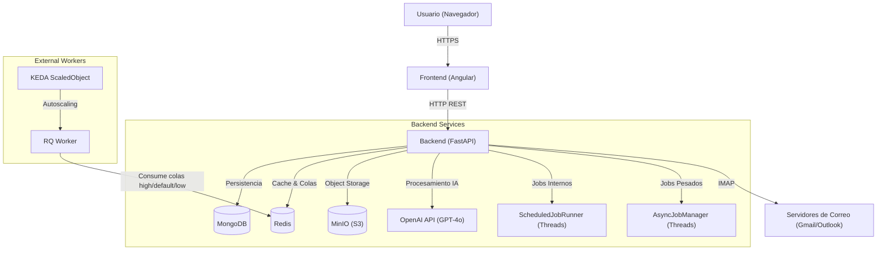
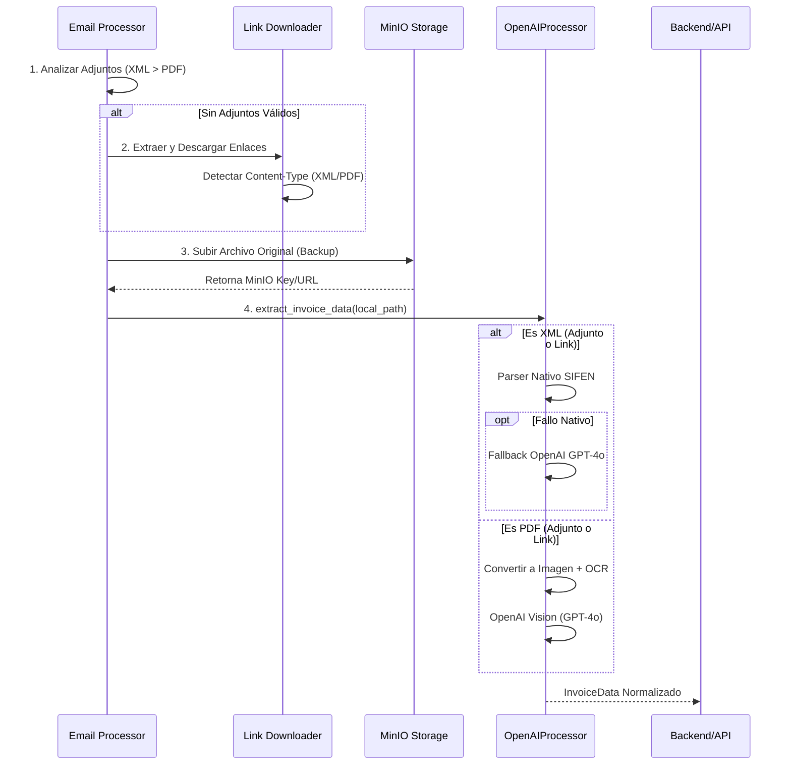
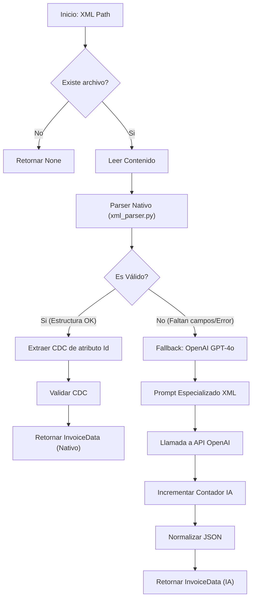
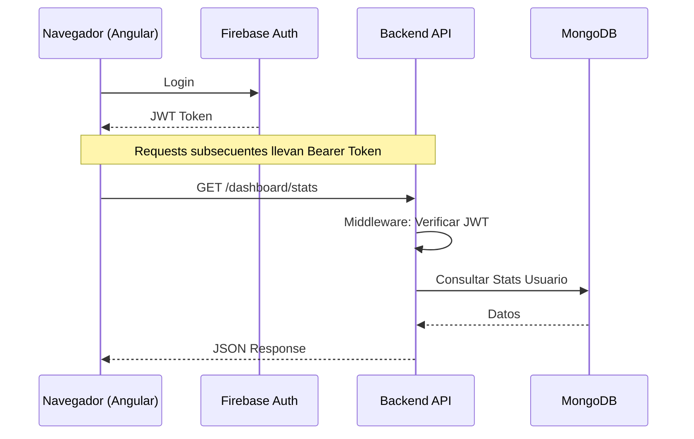
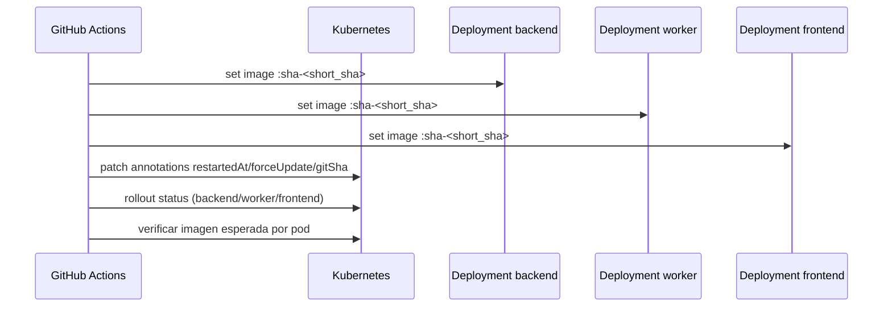

# Documentación Técnica de Cuenly

Esta documentación detalla la arquitectura técnica, los flujos de datos y los componentes del sistema Cuenly.

## 1. Arquitectura General del Sistema

El sistema utiliza una arquitectura de microservicios contenerizada con Kubernetes en produccion y Docker en desarrollo.

### Componentes Principales

*   **Frontend**: Aplicación Angular servida vía Nginx/Node.
    *   **State Management**: Implementación inicial con **Akita** para gestión centralizada de sesión de usuario (`SessionStore`).
*   **Backend**: API RESTful construida con FastAPI (Python 3.11).
*   **MongoDB**: Base de datos principal (NoSQL) para usuarios, facturas y configuraciones.
*   **Redis**: Sistema de cache para respuestas de OpenAI y broker de mensajeria de colas RQ.
*   **MinIO**: Almacenamiento de objetos compatible con S3 para guardar copias de seguridad de facturas procesadas (Originales PDF/XML). Su acceso está restringido según el plan de suscripción.
*   **Worker**: Servicio separado para procesamiento de tareas en cola (RQ) desplegado como `Deployment` en Kubernetes.

---

## 2. Flujos de Procesamiento de Documentos

El núcleo de Cuenly es la extracción de datos de facturas desde diversos formatos (Adjuntos o Enlaces).

### 2.0 Estrategia de Priorización de Archivos
El sistema analiza cada correo buscando facturas con la siguiente prioridad estricta para asegurar la máxima precisión al menor costo:

1.  **Adjuntos XML**: Máxima prioridad (Parser nativo, sin costo IA).
2.  **Adjuntos PDF**: Segunda prioridad (Visión IA).
3.  **Enlaces Externos**: Último recurso. Se descargan y analizan buscando XML o PDF.

### 2.1 Procesamiento de Imágenes, PDF y Enlaces

Los archivos (ya sean adjuntos o descargados de enlaces) se almacenan primero en MinIO antes de ser procesados.

### 2.2 Procesamiento de XML (Facturación Electrónica)

El flujo de XML prioriza un parser nativo rápido y económico, usando IA solo como respaldo (fallback) si la estructura es compleja o faltan datos críticos.

---

## 2.3 Seguridad y Validación de Archivos

Para garantizar que no se procesen archivos maliciosos, se ha implementado una capa de validación estricta usando **Magic Numbers** (librería `libmagic` / `python-magic`).

*   **Validación Real**: No se confía en la extensión del archivo (`.pdf`, `.jpg`).
*   **Inspección Binaria**: Se leen los primeros bytes del archivo para determinar su verdadero tipo MIME.
*   **Rechazo**: Si un archivo dice ser `.pdf` pero sus bytes indican que es un ejecutable (`application/x-executable`) o script, es rechazado inmediatamente antes de guardarse en disco.

---

## 3. Sistema de Tareas y Scheduling

Actualmente coexisten tres mecanismos de ejecución de tareas para diferentes propósitos:

### 3.1 ScheduledJobRunner (Procesamiento de Correos)
Es el motor principal para la descarga periódica de correos. Corre en **hilos dentro del contenedor Backend**.

*   **Ubicación**: `app.modules.scheduler.job_runner`
*   **Función**: Ejecuta `process_all_emails` cada X minutos.
*   **Estado**: Controlado por `MultiEmailProcessor`.
*   **Persistencia**: En memoria (si se reinicia el backend, se reinicia el intervalo).

### 3.2 AsyncJobManager (Tareas Pesadas / Históricas)
Maneja tareas largas solicitadas por el usuario (ej: "Sincronizar todo el año"). Usa MongoDB como cola de persistencia.

*   **Ubicación**: `app.modules.scheduler.async_jobs`
*   **Mecanismo**: 
    1.  API encola job en MongoDB (`jobs` collection).
    2.  Hilo `AsyncJobWorker` en Backend hace polling a MongoDB.
    3.  Ejecuta la tarea en background.
*   **Tipos de Jobs**: `full_sync`, `retry_skipped`.

### 3.3 RQ Worker (Redis Queue)
Infraestructura de workers separada y activa en Kubernetes para procesamiento asincrono desacoplado.

*   **Ubicación**: Contenedor `cuenly-worker`
*   **Colas**: `high`, `default`, `low`.
*   **Autoscaling**: Gestionado por KEDA (`ScaledObject`) segun CPU y longitud de cola Redis.
*   **Uso**: Tareas desacopladas que deben continuar aunque el backend rote pods durante deploy.

### 3.4 DataRetentionJob (Purga de Originales)
Job diario para cumplir con políticas de privacidad y ahorro de costes.
*   **Ubicación**: `app.modules.scheduler.jobs.retention_job`
*   **Frecuencia**: Diaria (03:00 AM).
*   **Lógica**: Elimina archivos de MinIO con antigüedad > 1 año (según `retention_days` del plan). Mantiene la metadata en MongoDB pero libera espacio de almacenamiento físico.

---

## 4. Comunicación Frontend - Backend

La comunicación se realiza mediante API REST estándar asegurada con Tokens (Firebase Auth).

## 5. Estructura de Datos Clave (MongoDB)

### Colecciones Principales
*   **`users`**: Perfiles, límites de IA, configuración de prueba (trial).
*   **`email_configs`**: Credenciales de correos (cifradas/OAuth tokens) vinculadas a usuarios.
*   **`processed_emails`**: Registro de UIDs de correos ya procesados para evitar duplicados.
*   **`invoices`**: Facturas extraídas y normalizadas (Header + Items).
*   **`jobs`**: Cola de tareas del `AsyncJobManager`.

## 6. Variables de Entorno Críticas

| Variable | Propósito |
| :--- | :--- |
| `OPENAI_API_KEY` | Acceso a modelos GPT-4o. |
| `MONGODB_URL` | Conexión a base de datos. |
| `REDIS_HOST` | Host de Redis. |
| `REDIS_PORT` | Puerto de Redis. |
| `REDIS_PASSWORD` | Password de Redis (si aplica). |
| `REDIS_DB` | Indice de base Redis. |
| `REDIS_SSL` | Activa conexion TLS a Redis. |
| `ENCRYPTION_KEY` | Cifrado de contraseñas de correos almacenadas. |
| `MINIO_ENDPOINT` | URL del servicio MinIO (S3). |
| `MINIO_ACCESS_KEY` | Access Key para S3/MinIO. |
| `MINIO_SECRET_KEY` | Secret Key para S3/MinIO. |
| `MINIO_BUCKET` | Bucket donde se almacenan las facturas procesadas. |

## 7. Rollout en Kubernetes

El pipeline de despliegue actualiza backend, worker y frontend con tags SHA, aplica anotaciones de reinicio y valida que los pods en estado `Running` tengan la imagen esperada.

